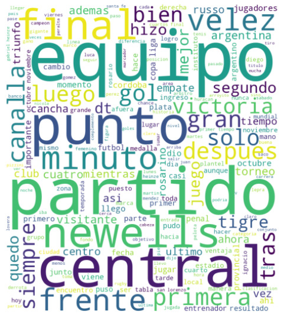

# Enlaces

- [Link al repositorio](https://github.com/Isaiasgaray/nlp)
- [Link al bot de Telegram](https://t.me/tuia_nlp_bot)

# Creación del dataset
Para este trabajo práctico vamos a obtener los datos de la página web del diario **La Capital**. En esta web se puede realizar el scraping de forma sencilla, ya que no hace falta loguearse ni interactuar con **JavaScript** para acceder al HTML con el texto de las noticias, por lo tanto solamente necesitamos usar las librearías `requests` y `beautifulsoup4`.

Para obtener los datos de interés usamos la sección de *Últimas Noticias* del sitio. En esta sección hay aproximadamente 150 links a noticias. El script itera sobre cada uno de estos links para acceder a ellos con `requests`. En cada noticia se obtiene el *título*, *texto*, *categoría*, *url* y *fecha* de la misma. Consideramos que es útil almacenar la fecha en la que se publicó la noticia porque puede servir para generar un resumen por categoría y fecha de las noticias para el ejercicio 5.

Además la fecha de la noticia sirve para que el scraper ignore noticias que no sean del día actual, esta verificación es útil porque se podría correr el script diariamente y actualizar el dataset con las nuevas noticias del día.

# Clasificador de títulos

*Precision*: ratio de predicciones positivas verdaderas al total de predicciones positivas hechas por el modelo. Mide la precisión al calcular una clase específica. Se calcula para cada clase/categoría.

*Recall*: ratio de positivos verdaderos comparados con los del modelo. Mide la habilidad del modelo para identificar instancias (filas) relevantes de una clase (columna).

*F1*: media armónica de *precision* y *recall*. Da un balance entre estas métricas, útil para calcular falsos positivos y falsos negativos.

*Support*: instancias (muestras) en cada clase, indica cuantos *datapoints* son de cada categoría.

Detalle del modelo:

- Selecciona las top $5$ categorías con mas de $10$ valores.
- Arma una muestra de $22$ de estas categorías, genera $2$ listas, agrego títulos y categorías respectivas.
- Modelo de regresión logistica, en el cual se tiene como resultado una precisión de $0.54$, en la mayoría de los casos las predicciones no van a ser erróneas. Este resultado es aceptable para el tamaño de este $dataset$ y el uso de tan pocas categorías hace que varíe muy poco, se podría mejorar agregando más datos o ajustando mejor el modelo.
- Por ejemplo, la categoría `ovacion` cuenta con un $0.2$ de precisión, pero es la categoría con menor soporte, por lo que estos resultados no son inesperados.

# Normalización y Nube de palabras.

**Para cada categoría, se realizan las siguientes tareas:**
**- Procesar el texto mediante recursos de normalización y limpieza.**
**- Con el resultado anterior, realizar conteo de palabras y mostrar la importancia de las**
**mismas mediante una nube de palabras.**
**Escribir un análisis general del resultado obtenido.**

Para procesar el texto realizamos las siguientes tareas:
1) Eliminamos los valores `NAN`, ya que al hacer el scraping donde la noticia tenía una historieta
el campo `texto` está vacío.

2) Usamos la expresión regular `[^\w\s]` para eliminar cualquier caracter que no sea una letra, es 
necesario para reducir el tamaño de nuestros datos y aumentar la eficiencia computacional.

3) Eliminamos los acentos para que cuando se realize la búsqueda esta sea insensible a los acentos.
Así nuestro texto estará homogenizado y no habrá inconsistencias en la acentuación.
4) Eliminamos las palabras *stopwords*, para que nuestro texto no tenga las palabras más comunes. 
Usamos la librería `nltk` para eliminar las *stopwords* y al realizar la nuebe de texto notamos que 
seguia habiendo palabras muy comunes como **si**, **dos**, **tres**, **año**, **años**, etc. Por lo que decidimos agregarlas como *stopwords* y así eliminarlas del corpus.
5) Hicimos correción ortográfica, para limpiar el texto y que no haya multiples palabras que 
tengan el mismo significado. Este proceso lleva unos minutos.

Realizamos la nube de palabras para ver la importancia de las mismas y notamos que las categorías están bien representadas en el gráfico, incluso si no sabemos el título de la categoria podríamos deducir de qué tema se está hablando. Por ejemplo, para Ovación las palabras más comunes que son *central*, *newells*, *equipo*, *partido*, *gol*, *punto*, *velez*, *minuto* nos harían saber que se trata de la sección deportiva del diario.

{width=40%}

# Similitud de títulos en la categoría Ovación

**Use los modelos de embedding propuestos sobre el final de la Unidad 2 para evaluar la similitud entre los títulos de las noticias de una de las categorías.**
**Reflexione sobre las limitaciones del modelo en base a los resultados obtenidos, en contraposición a los resultados que hubiera esperado obtener.**

Para evaluar la similitud entre los títulos usamos el modelo *Sentence-BERT* que tiene las siguientes características:

- Es multilingüe.
- Distingue entre mayúsculas y minúsculas.
- Es un modelo base, es decir, es la reducción de un modelo más grande.
- Su arquitectura está basada en *Transformers*. 
- Usa *embeddings* de oraciones, su representación vectorial contiene el contenido semántico de la oración.

Para abordar este problema, *Sentence-BERT* mejora a *BERT*, y utiliza redes siamesas y tripletas para crear *embeddings* de oraciones que pueden compararse utilizando la similitud del coseno. Esto hace que la búsqueda semántica sea computacionalmente factible, incluso cuando se trata de comparar un gran número de oraciones, reduciendo el tiempo de entrenamiento de varias horas a solo unos segundos. 

En nuestro código vamos a comparar por similitud del coseno a los títulos de la sección Ovación. Codificaremos los títulos para luego obtener la similitud. Después compararemos la similitud entre todas las oraciones y se mostrará una tabla para observar de forma decreciente los pares de oraciones que tiene mayor similitud.

Esperabamos que en las oraciones donde había palabras que se repetían, por ejemplo *newells* y *tigre*, la similitud sea alta y donde haya oraciones que no tengan palabras repetidas la similitud sea baja. Por lo que vemos en la tabla de comparación esto se cumple.

# Resumen de las noticias

## Resumen abstractivo

Probamos los siguientes tres modelos para realizar el resumen de la noticia de prueba. Los modelos se corrieron como indica la página de cada uno que adjuntamos en los items.

- **[MT5](https://huggingface.co/csebuetnlp/mT5_multilingual_XLSum)**: Es uno de los modelos que se uso en el apuntes de la unidad 2. Se entrenó con varios idiomas como indica su nombre, pero los resultados con la noticia de prueba son pobres, el resumen que genera no tiene sentido.

- **[BERT2BERT](https://huggingface.co/mrm8488/bert2bert_shared-spanish-finetuned-summarization)**: 
Elegimos este modelo porque es el que más descargas tiene para la tarea de resumir y el idioma español. El modelo está entrenado solo con texto en español. Sin embargo los resultados siguen sin ser buenos.

- **[Bart-Large-CNN](https://huggingface.co/facebook/bart-large-cnn)**: Es el modelo para resumir texto con más descargas de *Hugging Face*. Con este modelo se ven los mejores resultados, aunque en el resumen hay frases en inglés. Otro problema, al menos con este ejemplo, es que corta la frase antes de terminarla como se ve al final de su resumen.

Vemos que el resumen abstractivo podría llegar a ser muy bueno si nos tomaríamos el tiempo para entrenar a los modelos con noticias del diario, pero como nuestro *dataset* es muy pequeño y los resultados no son satisfactorios descartamos este tipo de resumen para este trabajo.

## Resumen extractivo

Se usa un grafo como estructura de datos con la librería *NetworkX* para hacer que cada oración sea un nodo del grafo y la similitud calculada anteriormente entre cada palabra es la arista. En esta implementación se van a obtener las dos frases más importantes del corpus para hacer el resumen. Como se sacan las frases del propio texto no vamos a tener los problemas que mencionados anteriormente.

# Bot de *Telegram*

El bot implementado muestra una lista con las categorías y la cantidad de noticias en cada una con los comandos `/start` y `/help`.

Supongamos que nos interesa la categoría de **Ovación**, entonces tendríamos que usar el comando `/ovacion` o hacer click en la categoría en el mensaje del bot. Luego se mostrarán los títulos de cinco noticias al azar de esa categoría seguidos de un número de identificación.

Usando el comando `/id` donde `id` es un número de identificación de alguna noticia, el bot nos responderá con el título, el resumen y el link de esa noticia.

También podemos buscar noticias con palabras claves del título, por ejemplo si enviamos la palabra *central* obtendremos el listado de las primeras cinco noticias con la palabra *central* en su título y sus correspondientes números de id.
